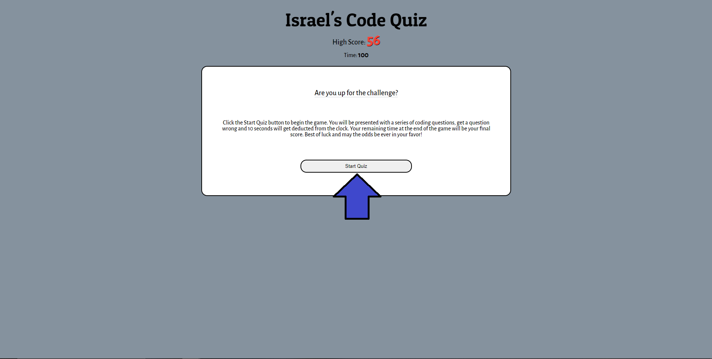
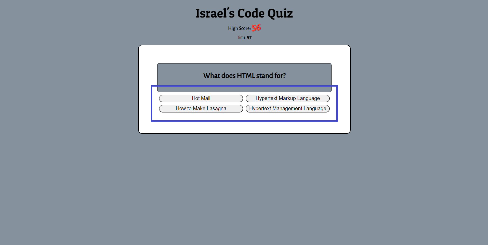
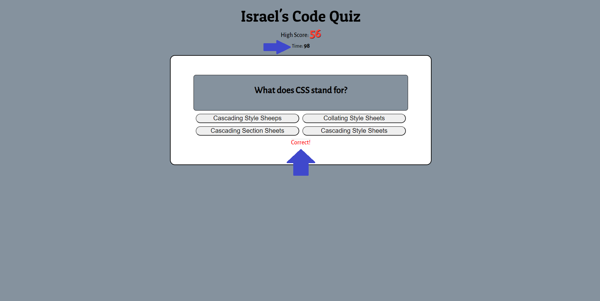
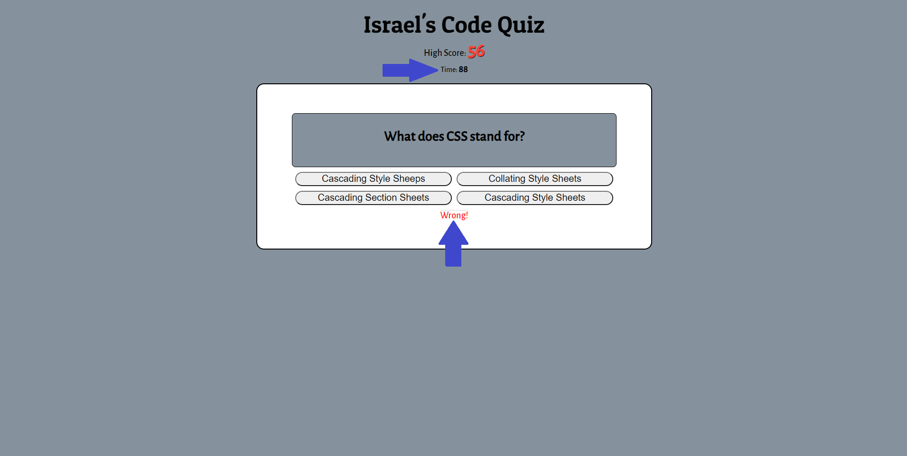
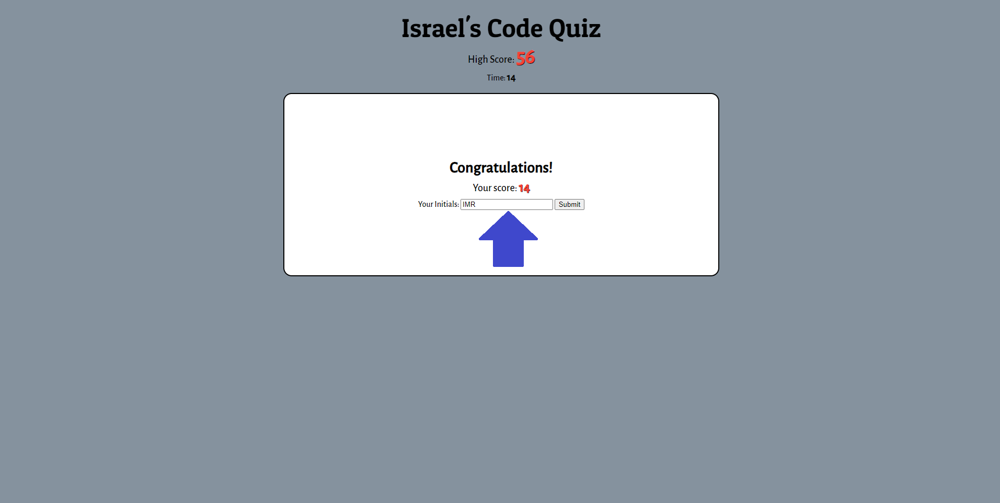
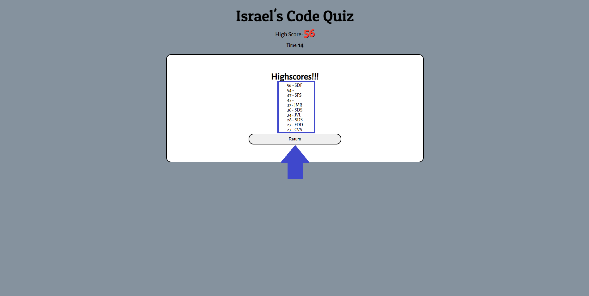

# Code-Quiz

## Description
This project was designed to use HTML, CSS and JavaScript to create a Code Quiz Game. This will enable anyone to play a fun and short game that challenges their knowledge in coding. Once you start the game a 100 second timer starts to count down. For every wrong question you get you lose 10 seconds off the clock. After answering 10 question your time left will be your final score. Once you enter your initials you will see a page of Highscores accomplished locally on your PC.

## Instructions

You can find the deployed application here&mdash;https://israelmrios.github.io/Code-Quiz/

### Step 1
```
Select 'Start Game' to begin the quiz.
```


### Step 2
```
Select an answer from the multiple-choice options.
```


### Step 3
```
If you select the correct answer the time will not decrease and you will see a notification stating 'Correct!'.
```


### Step 4
```
If you select the incorrect answer the till will be decreased by 10 seconds and you will see a notification stating 'Wrong!'.
```


### Step 5
```
After completing the Code Quiz, you will be presented with your final score. Enter your initials and click submit or enter.
```


### Step 6
```
Finally, you will be presented with a list of all the local highscores. Note as you keep playing it will store up to 10 of the highest scores.
```


## Resources Used
* [GitHub](http://github.com)
* [MDN Web Docs](https://developer.mozilla.org)
* [W3 Schools](https://www.w3schools.com/)
* [JavaScript Cheat Sheet](https://websitesetup.org/javascript-cheat-sheet/)
* [Request-Response](https://coding-boot-camp.github.io/full-stack/github/professional-readme-guide)

## License
MIT License
Copyright (c) [2021] [Israel M. Rios]